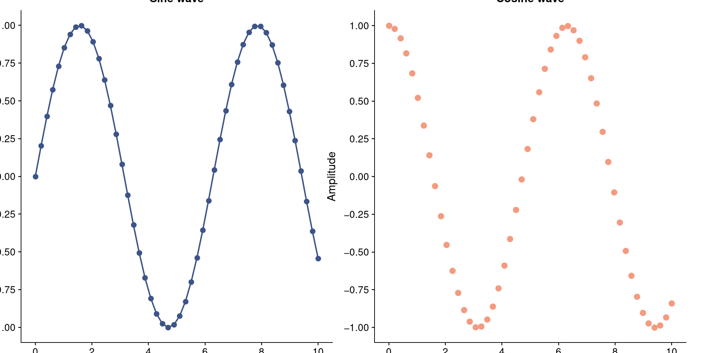
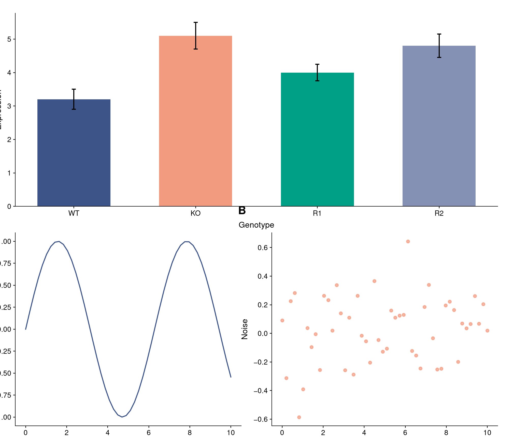
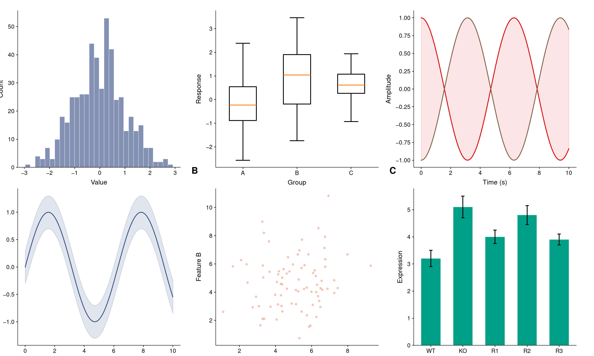
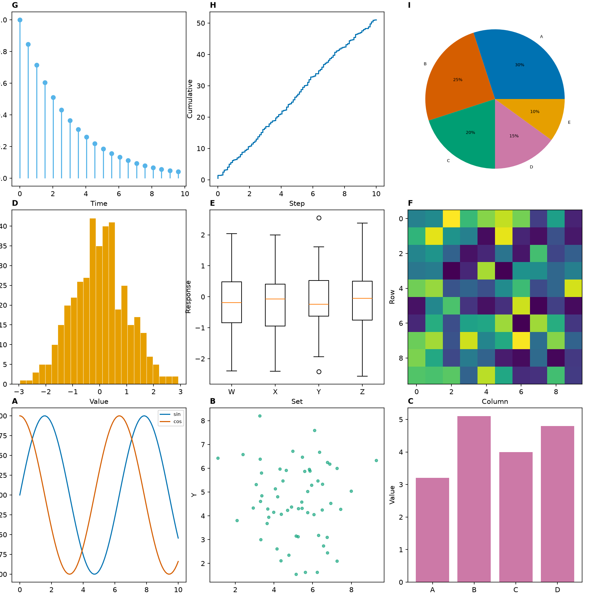
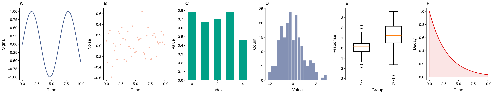
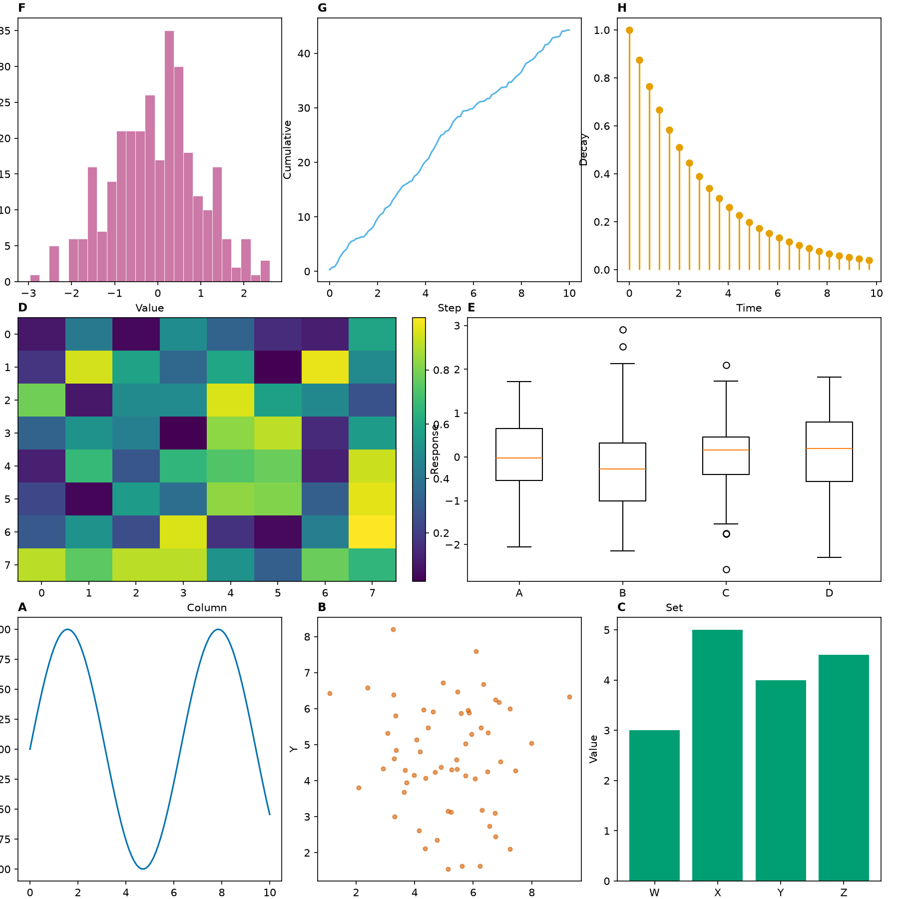
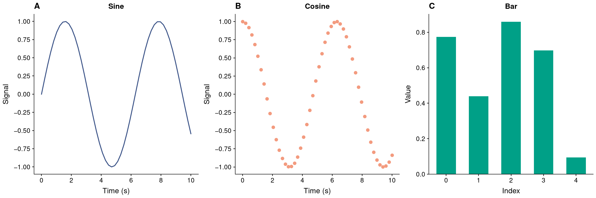

# 🧩 FigurePatch

**Compose multi-panel Matplotlib figures with `|` and `/` operators.**

[](https://pypi.org/project/figurepatch/)
[](https://www.python.org/)
[](https://matplotlib.org/)
[](LICENSE)

FigurePatch brings intuitive layout operators to Matplotlib. Wrap your existing plotting functions into panels, then compose them effortlessly using `|` (side-by-side) and `/` (stacked).

Powered by Matplotlib's native `constrained_layout` engine — automatically prevents text overlap, clips nothing, and reserves proper margins for labels, titles, and colorbars.

---

## The Mental Model in 5 Seconds

| Operator | Meaning | Layout |
|---|---|---|
| `p1 | p2` | Side-by-side | Horizontal split |
| `p1 / p2` | Stacked | Vertical split |
| `(p1 | p2) / p3` | Nested spanning | Top row 2 panels, bottom row spans full width |
| `(p1 | p2 | p3) / (p4 | p5 | p6)` | Equal grid | 2 rows × 3 columns |

---

## Quick Start

```bash
pip install figurepatch
```

```python
import matplotlib.pyplot as plt
import figurepatch as fp

@fp.panel
def panel_a(ax):
    ax.plot([1, 2, 3], [2, 4, 3])
    ax.set_xlabel("Time (s)")
    ax.set_ylabel("Signal")

@fp.panel
def panel_b(ax):
    ax.scatter([1, 2, 3], [3, 1, 2])
    ax.set_xlabel("Time (s)")
    ax.set_ylabel("Noise")

# Compose side-by-side with automatic A, B labels
fig = (panel_a | panel_b).render()
fig.savefig("figure.pdf")
```

---

## Visual Gallery & Layout Recipes

### 1. Side-by-Side — `panel_a | panel_b`

Two panels arranged horizontally.

```python
fig = (panel_a | panel_b).render(figsize=(7.2, 3.2))
```



---

### 2. Nested Spanning — `(panel_a | panel_b) / panel_c`

`panel_c` spans the entire bottom row automatically without manual `colspan`.

```python
fig = ((panel_a | panel_b) / panel_c).render(figsize=(6.5, 5.0))
```



---

### 3. 2×3 Grid — `(A | B | C) / (D | E | F)`

Six panels with equal column widths across two rows.

```python
fig = (panel_a | panel_b | panel_c) / (panel_d | panel_e | panel_f)
fig = fig.render(figsize=(8.0, 5.0))
```



---

### 4. 3×3 Grid — 9 Panels

Complete multi-panel display with mixed plot types (lines, scatter, bars, boxplots, heatmaps, pie charts).

```python
fig = (
    (panel_a | panel_b | panel_c)
    / (panel_d | panel_e | panel_f)
    / (panel_g | panel_h | panel_i)
).render(figsize=(8.5, 8.5))
```



---

### 5. Single Row — `A | B | C | D | E | F`

Six panels chained in a single horizontal strip.

```python
fig = (p1 | p2 | p3 | p4 | p5 | p6).render(figsize=(13.0, 2.5))
```



---

### 6. Irregular Rows — `(A | B | C) / (D | E) / (F | G | H)`

Row 1 has 3 panels, Row 2 has 2 wider panels (with colorbar), Row 3 has 3 panels.

```python
fig = (
    (panel_a | panel_b | panel_c)
    / (panel_d | panel_e)
    / (panel_f | panel_g | panel_h)
).render(figsize=(8.5, 7.5))
```



---

### 7. Compose Existing Figures — `fp.compose(fig1, fig2, fig3)`

Have existing `Figure` objects from disparate scripts or libraries? Compose them without rewriting your plotting code.

```python
fig = fp.compose(fig1, fig2, fig3, direction="h", figsize=(9.0, 3.0))
```



---

## Why FigurePatch?

### Before: Matplotlib GridSpec Boilerplate

```python
fig = plt.figure(figsize=(10, 8))
gs = fig.add_gridspec(2, 2)
ax1 = fig.add_subplot(gs[0, 0])
ax2 = fig.add_subplot(gs[0, 1])
ax3 = fig.add_subplot(gs[1, :])  # manual spanning

ax1.plot(x, y1)
ax1.set_xlabel("Time")
ax2.scatter(x, y2)
ax2.set_xlabel("Feature")
ax3.bar(x, y3)
ax3.set_xlabel("Group")

fig.tight_layout()
fig.savefig("figure.pdf")
```

### After: FigurePatch

```python
fig = ((panel_a | panel_b) / panel_c).render()
fig.savefig("figure.pdf")
```

---

## How It Works

FigurePatch compiles arbitrary composition trees into an exact 2D mosaic matrix, rendered through Matplotlib's native `layout="constrained"` engine:

1. **Automatic Area Alignment**: Chained horizontal or vertical panels automatically find their common least multiple and expand cleanly into grid cells.
2. **Zero Text Collision**: Dynamically measures bounding boxes for every tick mark, axis label, title, and colorbar to guarantee no overlapping text.
3. **No Edge Truncation**: Automatically reserves perimeter margins so negative tick values (e.g. `-1.00`) and titles are never cropped off.
4. **Bold Panel Labels**: Adds **A**, **B**, **C**... labels at the top-left of each axes that coexist harmoniously with centered plot titles.

---

## API Reference

### `@fp.panel`
Decorator converting a plotting function `func(ax)` into a composable `Panel`:
```python
@fp.panel
def my_plot(ax):
    ax.plot(x, y)
```

### Operators
- `panel_a | panel_b`: Places panels side-by-side.
- `panel_a / panel_b`: Stacks panels vertically.

### `.render(figsize=None, labels=True)`
Renders the composition tree into a `matplotlib.figure.Figure`.
- `figsize`: `(width, height)` in inches. Auto-estimated when omitted.
- `labels`: `True` for bold **A**, **B**, **C**... labels; a string (e.g. `"S"`) for prefixed labels (`S1`, `S2`...); or `False` to disable.

### `fp.compose(*items, direction="h", figsize=None, labels=True)`
Post-hoc composition for existing `Figure` or `Axes` objects.

---

## Compatibility

FigurePatch receives standard `matplotlib.axes.Axes`, making it 100% compatible with any library that plots on an existing axes:

| Library | Usage | Status |
|---|---|---|
| **Matplotlib** | Direct plotting on `ax` | Supported |
| **Seaborn** | Pass `ax=ax` (e.g., `sns.lineplot(..., ax=ax)`) | Supported |
| **pandas** | Pass `ax=ax` (e.g., `df.plot(..., ax=ax)`) | Supported |
| **Scanpy** | Pass `ax=ax` (e.g., `sc.pl.umap(..., ax=ax)`) | Supported |

---

## Development & Examples

```bash
git clone https://github.com/zh3li/FigurePatch.git
cd FigurePatch
uv sync

# Run the test suite
uv run pytest

# Run any gallery example
uv run python examples/basic_compose.py
uv run python examples/complex_layout.py
uv run python examples/grid_2x3.py
uv run python examples/grid_3x3.py
uv run python examples/grid_1x6.py
uv run python examples/irregular_3_2_3.py
uv run python examples/figure_compose.py
```

---

## License

FigurePatch is available under the [MIT License](LICENSE).
